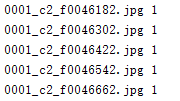

# Cleaned DukeMTMC-reID

Cleaned data list of DukeMTMC-reID released with our paper accepted by ICCV 2021: [Learning Instance-level Spatial-Temporal Patterns for Person Re-identification](https://arxiv.org/abs/2108.00171)

## Two kinds of samples are taken into consideration:

### 1. The samples with wrong labels, such as: 

The labels of this kind of samples are corrected. The percentage of corrected identifications in training database is 1.285%, and this percentage in test database is 1.282%.

### 2. The samples in which the pedestrian is completely occluded, such as: 

This kind of samples are eliminated. The percentage of this kind of samples in training database is 0.097%, and this percentage in test database is 0.146%.

## Cleaned database

The data of DukeMTMC-reID can be found [here](http://vision.cs.duke.edu/DukeMTMC/).

The list of cleaned training database is `train_cleaned.txt`

The query list of cleaned test database is `query_cleaned.txt`

The gallery list of cleaned test database is `gallery_cleaned.txt`

#### There two elements in each line of the cleaned lists: file name and label.

### Dataset Licence

Please follow the [LICENSE_DukeMTMC-reID](https://github.com/layumi/DukeMTMC_reID_evaluation/blob/master/LICENSE_DukeMTMC-reID.txt). You are free to share, create and adapt the DukeMTMC-reID dataset, in the manner specified in the license. 

# Citation

If you find our cleaned database useful in your research, please consider to cite:

    @inproceedings{ren2021learning,
      author={Ren, Min and He, Lingxiao and Liao, Xingyu and Liu, Wu and Wang, Yunlong and Tan, Tieniu},
      title={Learning Instance-level Spatial-Temporal Patterns for Person Re-identification},
      booktitle = {Proceedings of the IEEE/CVF International Conference on Computer Vision (ICCV)},
      year={2021}
    }

    
